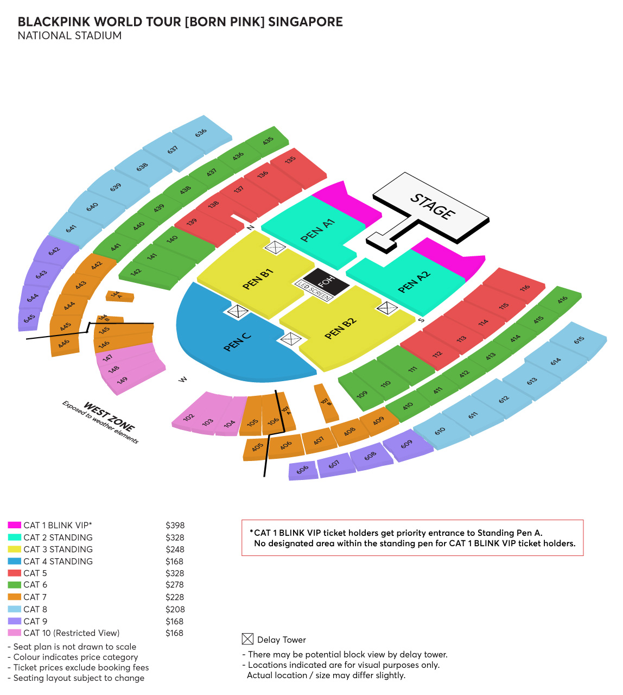
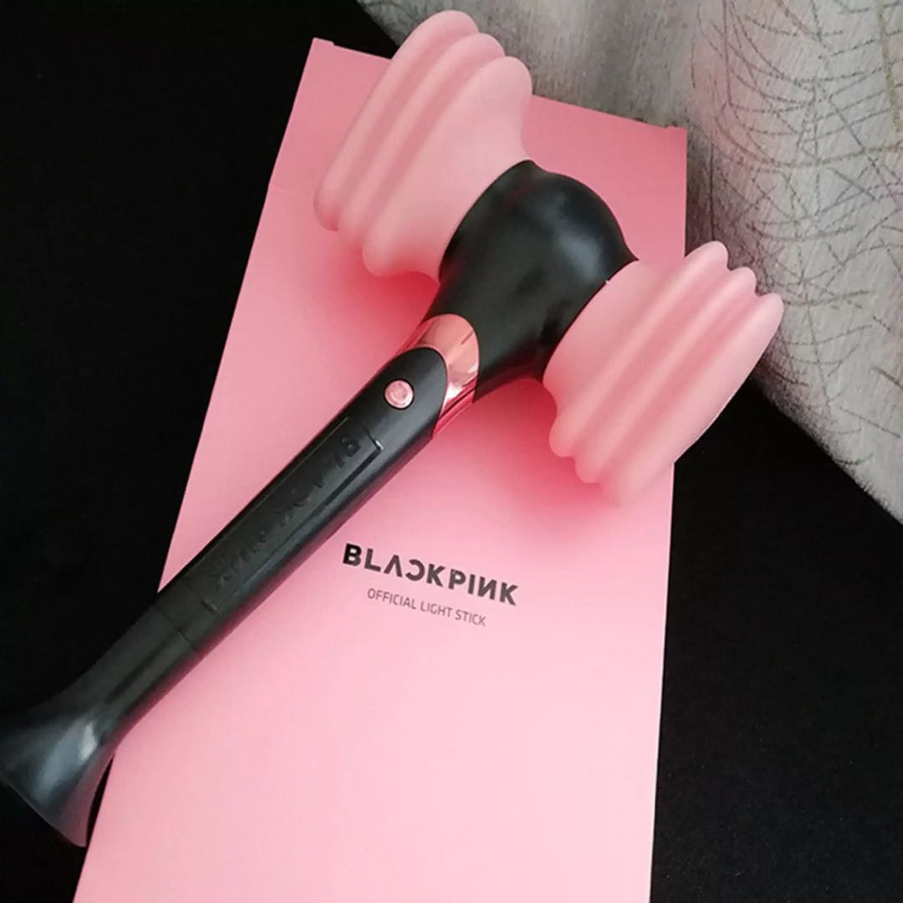

# BLACKPINK'S Merch

This Website sells BLACKPINK'S Merch which includes albums, lightstick, shirt, keychains, photocards and many more. For K-POP fans or BLACKPINK'S fan (known as BLINKS). Beside selling their merch, the website also contain their profile and history of the BLACKPINK. BLINKS or anyone can use this website to learn and buy things of BLACKPINK.
In summary this website provides users with information aboutn BLACKPINK and to shop for BLACKPINK's merch, at the same time to promote BLACKPINK and increase sales.

## Features

- History of Blackpink
- Blackpink member's profile
- Ongoing activies(concert)
- Selling merch
  - albums
  - photocards
  - shirts

## Profile of BLACKPINK

- Debut Date:
  - **08 August 2016**
  - Debuted for **6 Years**
- **Fandom Name**: :two_hearts:BLINKS:two_hearts:
- Consists of **4 Members**
  1. Jisoo:fire:
  2. Jennie:fire:
  3. Rosé:fire:
  4. Lisa:fire:
- Under **YG Entertainment**
- Performed at **Coachella in 2019**
- :crown:Collaborated with **Dua Lipa, Lady Gaga, Selena Gomez and Cardi B**:crown:
- Most recent comeback: **Bornpink**
  - Consists of **8 Songs**
- :ribbon:**Instagram account**: [blackpinkofficial](https://www.instagram.com/blackpinkofficial/):ribbon:
- :ribbon:**Youtube**: [Blackpink](https://www.youtube.com/channel/UCOmHUn--16B90oW2L6FRR3A):ribbon:

## Profile of members

### :sparkles:Jisoo:sparkles:

- **Nationality**: Korean
- **Date of Birth**: 03 January 1995:birthday:
- **Birth name**: Kim Jisoo :rabbit:
- **Position**: Lead Vocalist, Visual
- **Height**: 162cm
- **weight**: 44kg
- She is also an **actor** (acted in Snowdrop in year 2021/2022)
- Selected and ranked as **'The Most Beautiful Woman in the World'** in 2022:crown:
- Have a pet dog (Name: **dalgom**)
- :ribbon:**Instagram**: [sooyaaa\_](https://www.instagram.com/sooyaaa__/):ribbon:

### :sparkles:Jennie:sparkles:

- **Nationality**: Korean
- **Date of Birth**: 16 January 1996:birthday:
- **Birth name**: Kim Jennie
- **Position**: Main Rapper, Lead Vocalist
- **Height**: 163cm
- **weight**: 45kg
- She lived in **New Zealand for 5 years**
- Made her **acting debut** with HBO's "The Idol"
- Have 2 dogs (Name: **Kuma and Kai**)
- :ribbon:**Instagram**: [jennierubyjane](https://www.instagram.com/jennierubyjane/):ribbon:
- :ribbon:**Youtube**: [Jennierubyjane Official](https://www.youtube.com/c/JennierubyjaneOfficial_BLACKPINK):ribbon:

### :sparkles:Rosé:sparkles:

- **Nationality**: New Zealander
- **Date of Birth**: 11 February 1997:birthday:
- **Birth name**: Roseanne Park
- **Position**: Main Vocalist, Lead Dancer
- **Height**: 168.7cm
- **Weight**: 44kg
- Have 2 fish (Name: **Joohwangie and Eunbyul**)
- Adopted a dog (Name: **Hank**)
- :ribbon:**Hank's Instagram**: [hank_says_hank](https://www.instagram.com/hank_says_hank/):ribbon:
- :ribbon:**Instagram**: [roses_are_rosie](https://www.instagram.com/roses_are_rosie/):ribbon:
- :ribbon:**Youtube**: [Rosesarerosie](https://www.youtube.com/c/ROS%C3%89Official_BLACKPINK):ribbon:

### :sparkles:Lisa:sparkles:

- **Nationality**: Thai
- **Date of Birth**: 27 March 1997:birthday:
- **Birth name**: Pranpriya Manoban (Legalized to Lalisa Manoban)
- **Position**: Main Dancer, Lead Rapper, Sub Vocalist, Maknae (youngest)
- **Height**: 166.5 cm
- **Weight**: 44.7kg
- Ranked **first** on TC Candler **"The 100 Most Beautiful Faces of 2021" in 2021**:crown:
- Chosen as **dance mentor** for Chinese show "Youth With You 2" and "Youth With You 3"
- Have five cats (Name: **Leo, Lucy, Lily, Louis, Lego**)
- Have a dog (Name: **Love**)
- :ribbon:**Pets Instagram**: [lalala_lfamily](https://www.instagram.com/lalala_lfamily/):ribbon:
- :ribbon:**Instagram**: [lalalalisa_m](https://www.instagram.com/lalalalisa_m/):ribbon:
- :ribbon:**Youtube**: [Lilifilm](https://www.youtube.com/@lalalalisa_m):ribbon:

## Songs from BLACKPINK:musical_note:

### :musical_note:Square One:musical_note:

- **Boombayah**
- **Whistle**
- Realised on 8 August 2016

### :musical_note:Square Two:musical_note:

- **Playing With Fire**
- **Stay**
- Realised on 1 November 2016

### :musical_note:As If Its's Your Last:musical_note:

- **As If Its's Your Last**
- Realised on 22 June 2017

### :musical_note:Square Up:musical_note:

- **Ddu-Du,Ddu-Du**
- **Forever Young**
- **Really**
- **See U Later**
- Realised on 15 June 2018

### :musical_note:Kiss and Make Up:musical_note:

- **Kiss and Make Up**
- Collab with Dua Lipa
- Realised on 19 October 2018

### :musical_note:Kill This Love:musical_note:

- **Kill This Love**
- **Don't Know What To Do**
- **Kick It**
- **Hope Not**
- **Ddu-du,Ddu du(Remix)**
- Realised on 5 April 2019

### :musical_note:Sour Candy:musical_note:

- **Sour Candy**
- Collab with Lady Gaga
- Realised on 28 May 2020

### :musical_note:The Album:musical_note:

- **How You Like That**
- **Ice Cream**
  - Collab with Selena Gomez
- **Pretty Savage**
- **Bet You Wanna**
  - Collab with Cardi B
- **Lovesick Girls**
- **Crazy Over You**
- **Love To Hate Me**
- **You Never Know**
- Realised on 2 October 2020

### :musical_note:Bornpink (LATEST):musical_note:

- **Pink Venom**
- **Shut Down**
- **Typa Girl**
- **Happiest Girl**
- **Tally**
- **Yeah Yeah Yeah**
- **Hard To Love**
- **Ready For Love**
- Realised on 16 September 2022

### :musical_note:SOLO:musical_note:

- **SOLO**
- Jennie's solo song

### :musical_note:On The Ground:musical_note:

- **On The Ground**
- **Gone**
- Rosé's solo songs

### :musical_note:Lalisa:musical_note:

- **Lalisa**
- **Money**
- Lisa's solo song

## World Tour 2022:satisfied:

#### :earth_asia:Countries:earth_asia::

- Seoul
- North America: Dallas, Houston, Atlanta, Hamilton, Chicago , Newark, Los Angeles
- Europe: London, Barcelona, Cologne, Paris, Berlin, Amsterdam
- Asia: Bangkok, Hongkong, Riyadah, Abu Dhabi, Kuala Lumpur, Jakarta, Kaohsiung, Manila, :heart_eyes:**Singapore**:heart_eyes:,
- Australia: MelBourne, Sydney, AuckLand

#### :heart_eyes:Information on concert in Singapore:heart_eyes::

- Date: **13 May 2023, Saturday**
- Time: **7.30PM**
- Location: **Singapore Stadium**
- Tickets can be bought from: [ticketmaster](https://ticketmaster.sg/)

#### :star2:Seating Plan:star2::

- CAT :one::
  - ONLY FOR BLINK VIP
  - Price: **$398**
- CAT :two::
  - STANDING
  - Price: **$328**
- CAT :three::
  - STANDING
  - Price: **$248**
- CAT :four::
  - STANDING
  - Price: **$168**
- CAT :five::
  - SEATED
  - Price: **$328**
- CAT :six::
  - SEATED
  - Price: **$278**
- CAT :seven::
  - SEATED
  - Price: **$228**
- CAT :eight::
  - SEATED
  - Price: **$208**
- CAT :nine::
  - SEATED
  - Price: **$168**
- CAT :keycap_ten::
  - SEATED (Restricteed view)
  - Price: **$168**

##### :ticket:Tickets:ticket:

- Price range: **$168-$398**
- **Membership**: 7 Nov 2022 to 9 Nov 2022: BLINK MEMBERSHIP Presale
- :heart:BLINK MEMBERSHIP:
  - **21 November 2022**
  - Early Bird: 10AM
  - General: 11AM
- :heart:PayPal Presale:
  - **22 November 2022**
  - 10AM
- :heart:Live Nation Presale
  - **23 November 2022**
  - 10AM
- :heart:General Sale
  - **24 November 2022**
  - 10 AM

## Sales item (merch)

### LightStick

- Price: $58.00

### Bornpink Album

- :gift_heart:ALBUM BOX SET VERSION

  - 3 versions (Black, Pink, Grey)
  - Price: $18.51

- :gift_heart:DIGIPACK VERSION

  - 4 versions (Jisoo, Jennie, Lisa, Rosé)
  - Price: $12.22

- :gift_heart:KIT ALBUM

  - Price: $27.86

- :gift_heart: LP (LIMITED EDITION)
  - Price: $55.53

### The Album

- :gift_heart:ALUBUM BOX SET VERSION
  - 4 versions (Black, Pink, Black with Pink holo side, Pink Holographic)
  - Price: $ 30.00

### Kill This Love

- :gift_heart:ALBUM VERSION
  - 2 versions (Black and Pnk)
  - Price: $25.00

### Square Up

- :gift_heart:ALBUM VERSION
  - 2 versions (Black and Pink)
  - Price: $24.00

### Solo

- :gift_heart:ALBUM VERSION
  - Price: $21.00

### Lalisa

- :gift_heart:ALBUM VERSION
  - 2 version (Black and Gold)
  - Price: $27.00

### On The Ground

- :gift_heart:ALBUM VERSION
  - Price: $29.00

### Bornpink World Tour Merch

- :gift_heart:BLACKPINK PHOTO PACKAGE

  - Price: $17.65

- :gift_heart:BLACKPINK LYRICSS CARD + PHOTO CARD SET

  - Price: $ 14.86

- :gift_heart:BLACKPINK CHARACTOR PLUSH TOY

  - 4 versions
  - Price: $36.23

- :gift_heart:BLACKPINK BEANIE

  - 2 versions (Black and Grey)
  - Price: $23.22

- :gift_heart:BLACKPINK PHOTO KEYRING

  - 4 versions (Jisoo, Jennie, Lisa, Rosé)
  - Price: $23.22

- :gift_heart:BLACKPINK STICKER PACK

  - Price: $7.43

- :gift_heart:BLACKPINK TOUR T-SHIRTS (TYPE 1)

  - Price: $39.01

- :gift_heart:BLACKPINK TOUR T-SHIRTS (TYPE 2)

  - 2 version (White and Grey)
  - Price: $39.01

- :gift_heart:BLACKPINK TOUR T-SHIRTS (TYPE 3)

  - 2 version (White and Pink)
  - Price: $39.01

- :gift_heart:BLACKPINK TOUR T-SHIRTS (TYPE 4)

  - 2 version (White and Grey)
  - Price: $39.01

- :gift_heart:BLACKPINK HAIT PIN

  - 3 versions (White, Pink, Black)
  - Price: $12.07

- :gift_heart:BLACKPINK POP UP PHOTO BOOK
  - 4 versions (Jisoo, Jennie, Lisa, Rosé)
  - Price: $12.07
